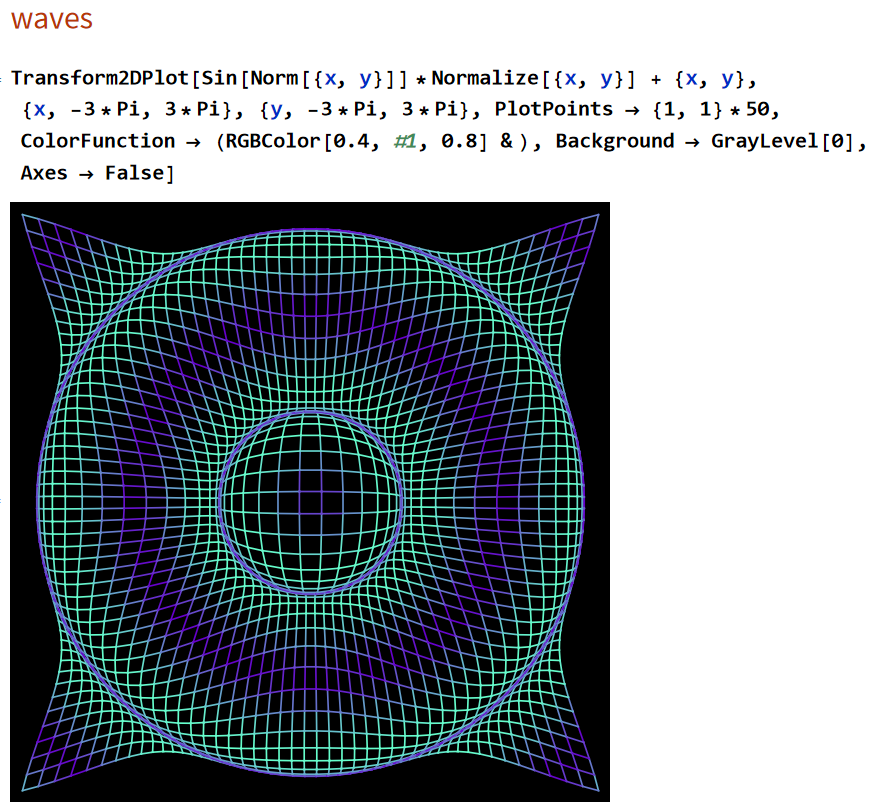
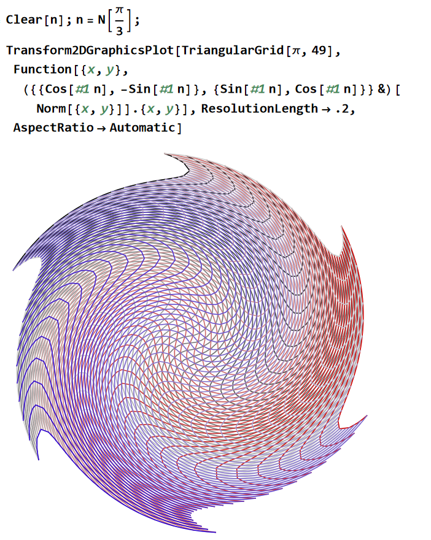
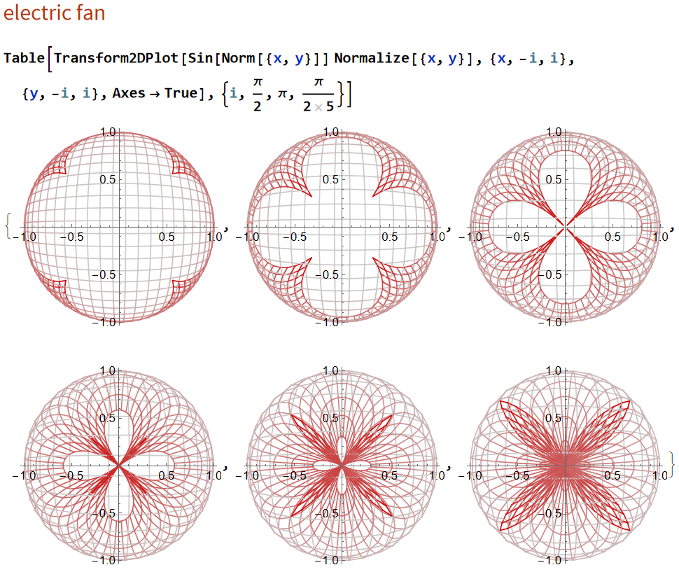
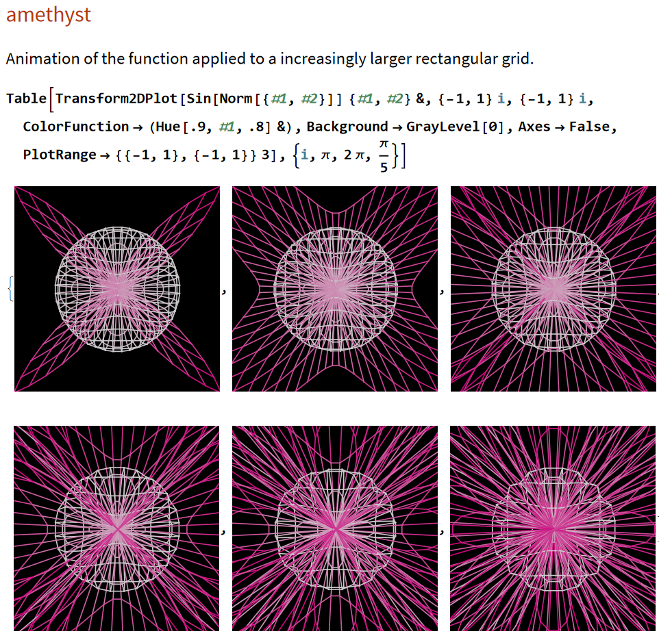
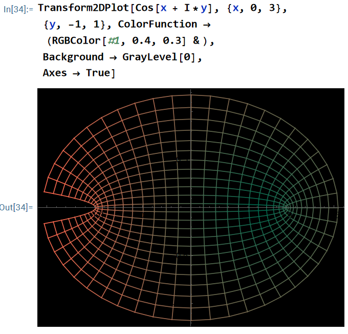
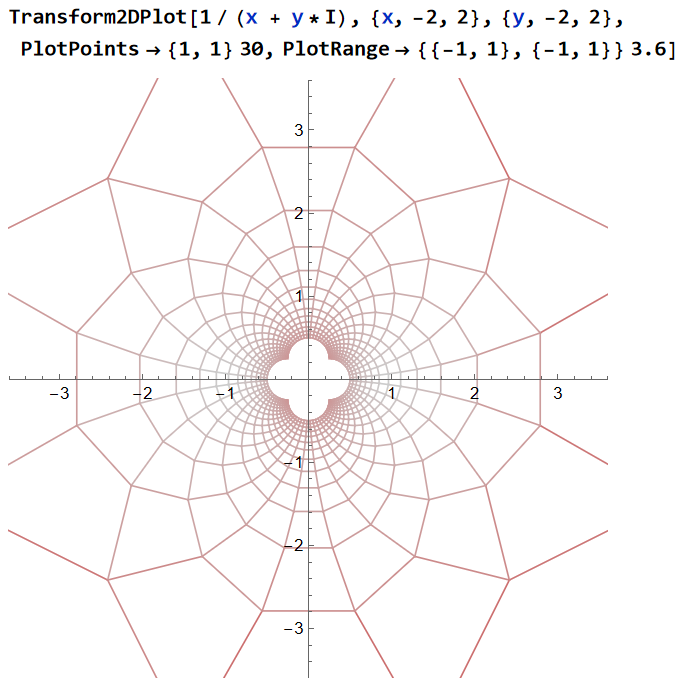
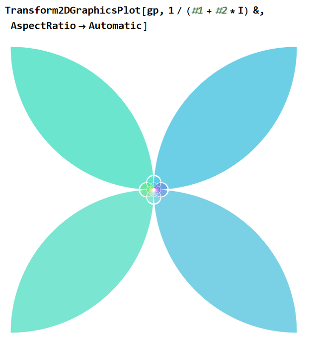
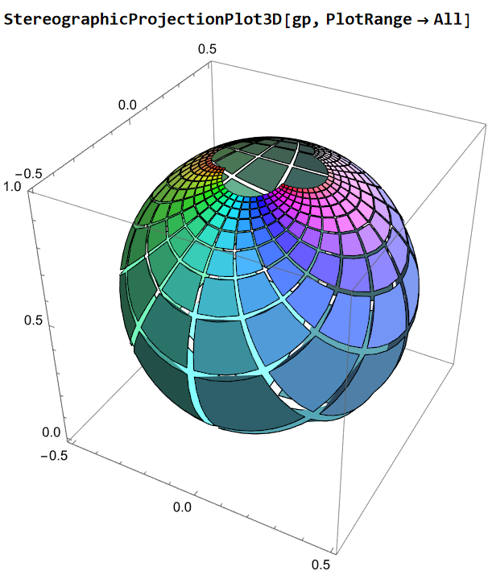

## Transform2DPlot

Transform2DPlot is a package for Wolfram language / Mathematica for visualization of planar transformations.

you can plot 2d vector function, or complex valued function, or transform any 2d graphics object, or show them in reimann sphere (stereographically project a plane to a sphere)

## Files

Transform2DPlot.wl
is the code.

Transform2DPlot_Documentation.nb
is the documentation.

Transform2DPlot_gallery.nb
is pretty examples.

all exported symbols are fully documented. 

## Feature Gallery

## Home Page URL

http://xahlee.info/complex/Mathematica/packages.html

Thanks to Wolfram Research for sponsor.
